Toyota Used Car Market Mispricing Analysis

A data analysis project that identifies mispriced vehicles in the Toyota used car market using machine learning regression models and statistical indicators.

This project builds a predictive pricing model and compares the predicted fair value with the actual listing price to detect undervalued and overvalued cars.

Project Objective

Used car buyers and sellers often struggle to determine whether a vehicle is fairly priced.

This project aims to:

Predict the fair market price of Toyota vehicles

Quantify mispricing using a relative deviation index

Identify undervalued purchase opportunities

Analyze market pricing patterns across models and vehicle ages

Methodology

Data Cleaning & Feature Engineering

Exploratory Data Analysis

Price Prediction Model (Regression)

Random Forest (Test R²: 0.863; MAE/RMSE/MAPE reported in notebook)

Mispricing Indicator Construction

Market Pattern Analysis

Mispricing Index

relative_deviation = (actual_price - predicted_price) / predicted_price

Interpretation:

Negative → Undervalued (Good deal)

Positive → Overpriced

Near 0 → Fairly priced

Data Source

Dataset: Toyota Used Cars Market Insights
 (Kaggle, Anas Sarfraz)

Scope: ~6,738 UK Toyota listings (circa 2020)

Features: model, registration year, mileage, transmission, fuel type, engine size, MPG, listing price

Constraints: Cross-sectional snapshot only (no transaction outcomes, no time-to-sale, no dealer identity, no geography).

Key Visualizations
Price Relationships

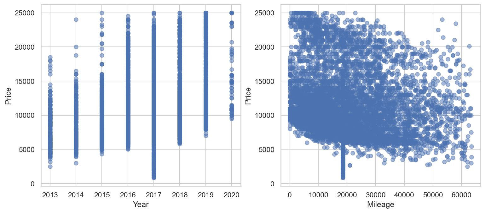

Price Distribution by Model

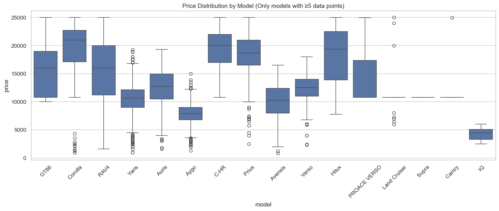

Correlation Matrix

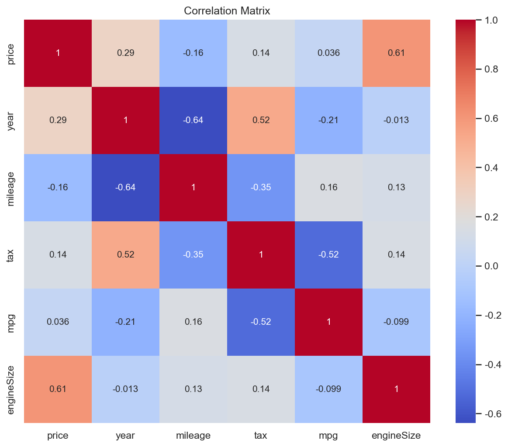

Mispricing Analysis

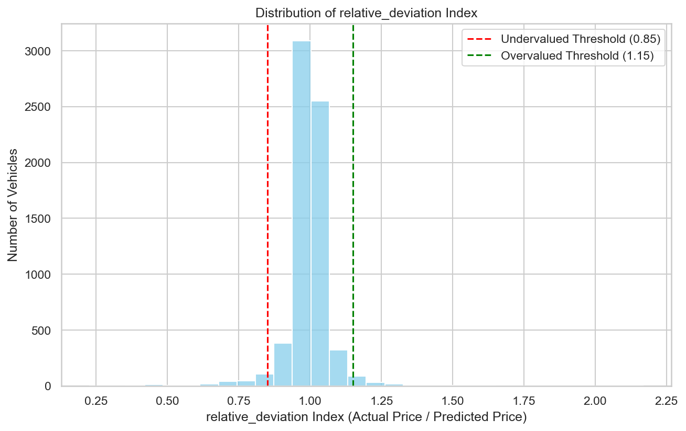
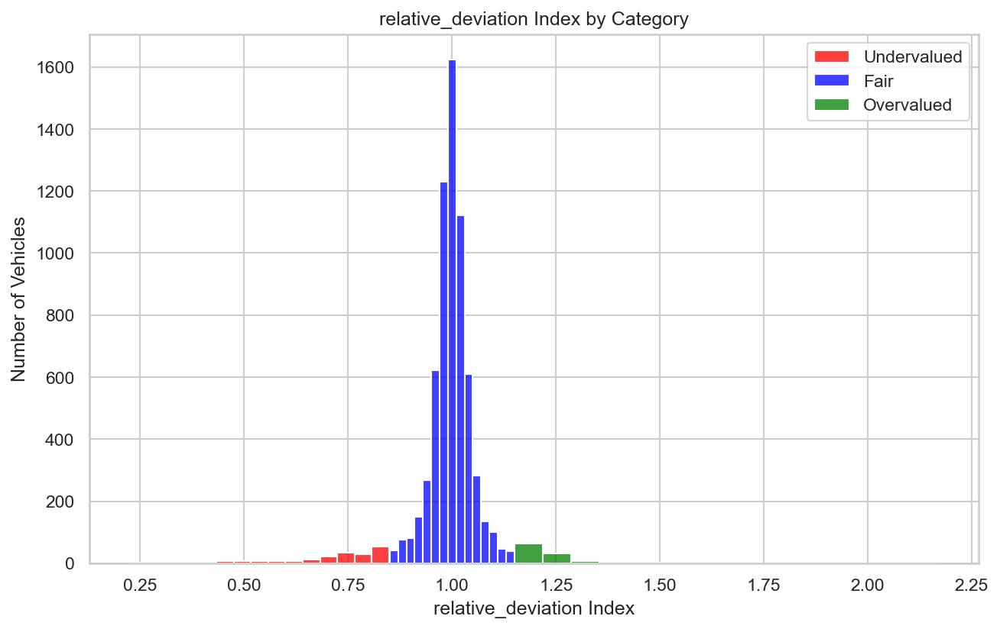
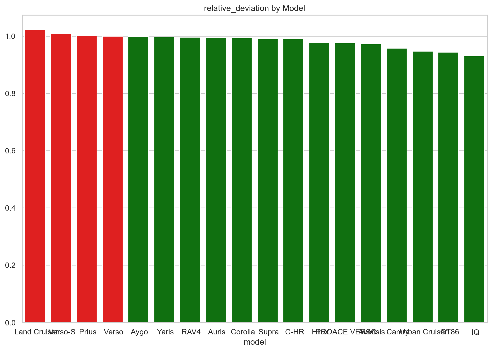
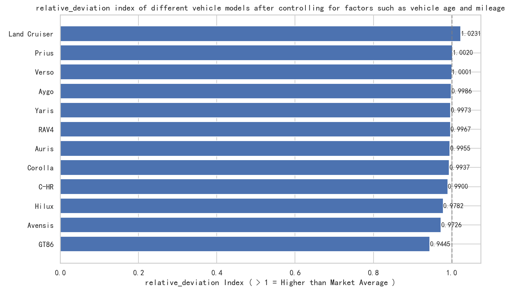
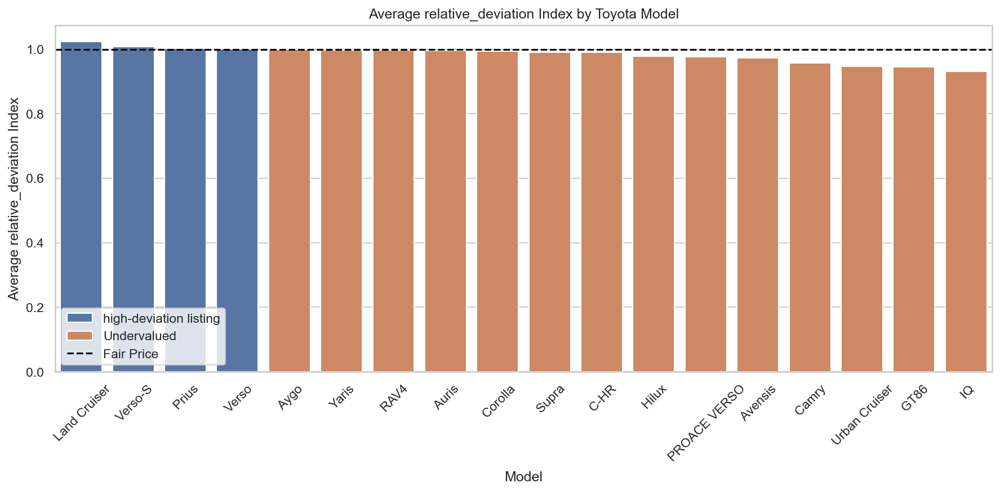

Vehicle Age Analysis

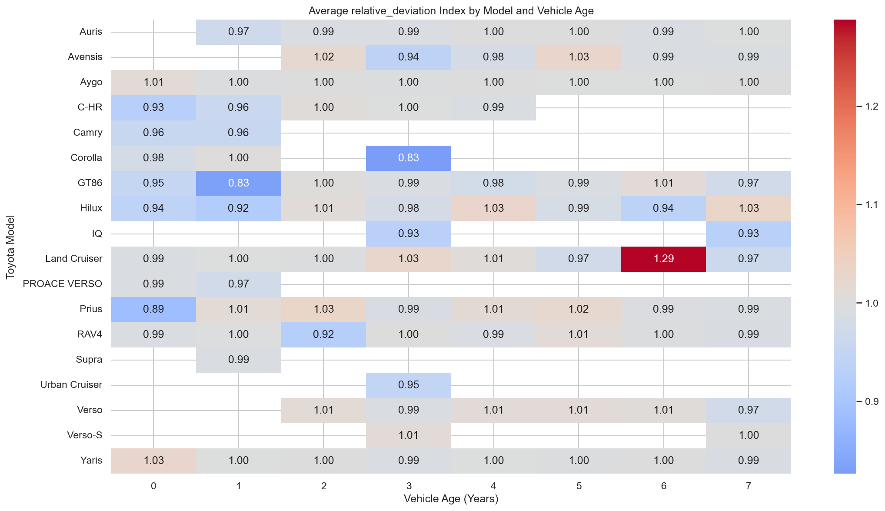
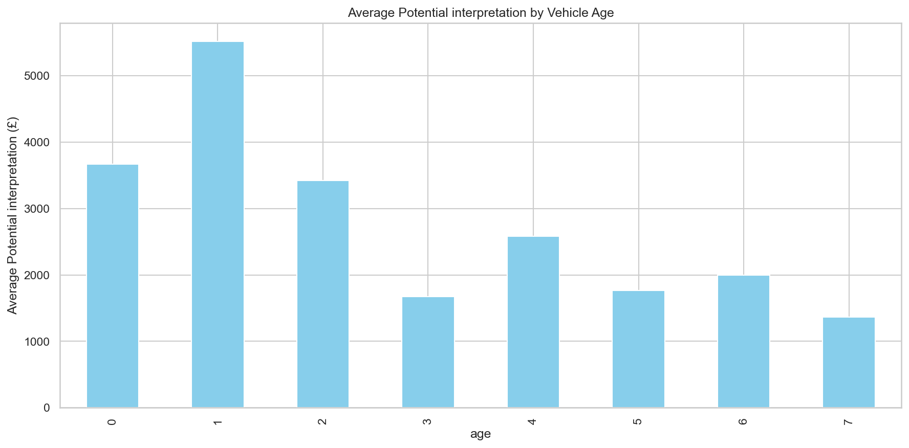

Recommended Vehicles

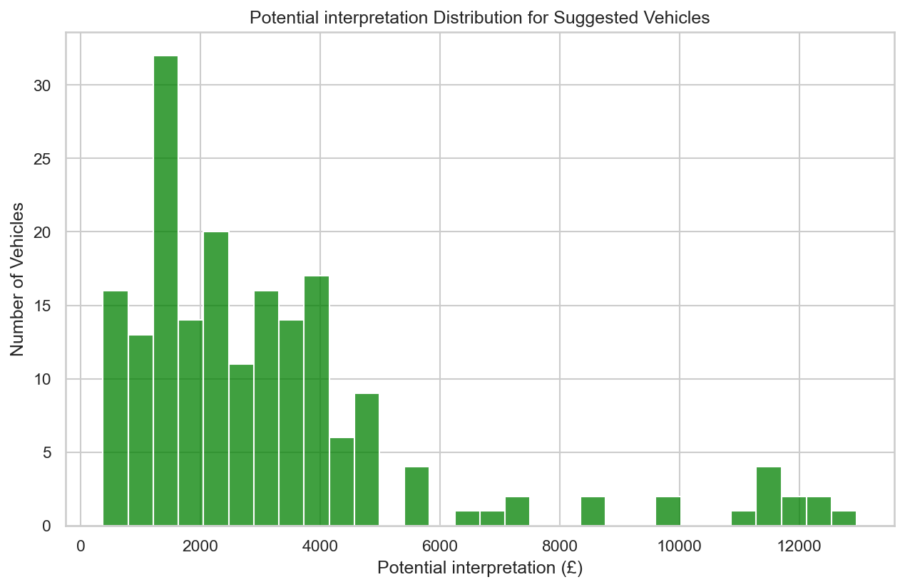

This chart highlights vehicles with the highest undervaluation potential, representing the best purchase opportunities.

Repository Structure
Toyota-Used-Car-Market-Mispricing-Analysis/
│
├── toyota.csv
├── Toyota-Used-Car-Market-Mispricing-Analysis.ipynb
├── index.html
├── images/
│   ├── Average Potential interpretation by Vehicle Age.png
│   ├── Average relative_deviation Index by Model and Vehicle Age.png
│   ├── Average relative_deviation Index by Toyota Model.png
│   ├── Correlation Matrix.png
│   ├── Distribution of relative_deviation Index.png
│   ├── Potential interpretation Distribution for Suggested Vehicles.png
│   ├── Price Distribution by Model.png
│   ├── Year vs Price and Mileage vs Price.png
│   ├── relative_deviation Index by Category.png
│   ├── relative_deviation by Model.png
│   └── relative_deviation index of different vehicle models.png
│
└── README.md

How to View the Project

Full interactive report (figures, model diagnostics, code outputs):
👉 https://xyh06.github.io/Toyota-Used-Car-Market-Mispricing-Analysis/

Technologies Used

Python

Pandas

NumPy

Matplotlib

Seaborn

Scikit-learn

Jupyter Notebook

Author

Undergraduate Data Science Student
Focus: Data Analysis & Machine Learning Applications

Last Updated: February 2026
